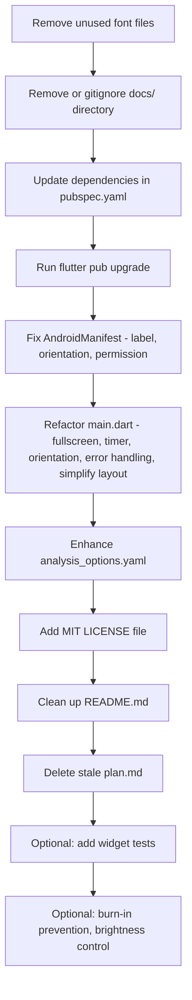

# Nightstand AOD Clock — Project Review & Improvement Plan

**Date:** 2026-03-09  
**Scope:** Full project scan, code review, dependency audit, improvement suggestions

---

## 1. Project Summary

A minimal Flutter always-on-display clock app for Android. Displays the current time in large OpenDyslexic Nerd Font on a pure black AMOLED background. Uses `wakelock_plus` to keep the screen on.

**Stack:** Flutter 3.24+, Dart 3.11+, single-file architecture in [`main.dart`](lib/main.dart)

---

## 2. Critical Issues

### 2.1 Massive Unused Font Assets — APK Bloat 🔴

The [`assets/fonts/`](assets/fonts/) directory contains **~100+ font files** across 10+ font families — all NerdFont variants — yet the app only uses **one font**: `OpenDyslexicMNerdFont-Regular.otf`.

The [`pubspec.yaml`](pubspec.yaml:24) declares `- assets/fonts/` which bundles **every file** in that directory into the APK.

**Impact:** The APK is inflated by potentially **200+ MB** of unused fonts.

**Fix:** Remove all unused font files. Keep only `OpenDyslexicMNerdFont-Regular.otf`, or at most the OpenDyslexic family variants that are needed.

### 2.2 `docs/` Web Build in Version Control 🔴

The [`docs/`](docs/) directory contains a full Flutter web build with compiled JS, duplicated font assets, and build artifacts. This adds **hundreds of MB** to the repository.

**Fix:** Either remove `docs/` from git tracking and add to `.gitignore`, or set up CI/CD to auto-deploy to GitHub Pages.

### 2.3 Timer Fires Every Second, Display Only Shows Minutes 🟡

In [`_ClockScreenState.initState()`](lib/main.dart:37), the timer fires every **1 second**, but the display only shows `HH:mm`. This means 59 out of 60 `setState()` calls per minute are wasted rebuilds.

**Fix:** Calculate time until next minute boundary, use `Timer` to wait, then start a `Timer.periodic` of 60 seconds.

### 2.4 No Fullscreen / Immersive Mode 🟡

For a nightstand AOD clock, the status bar and navigation bar should be hidden to maximize screen real estate and prevent accidental taps.

**Fix:** Add `SystemChrome.setEnabledSystemUIMode(SystemUiMode.immersiveSticky)` in [`initState()`](lib/main.dart:33).

### 2.5 Orientation Lock is Commented Out 🟡

In [`build()`](lib/main.dart:57), the orientation lock is commented out. Even if uncommented, calling it in `build()` is wrong — it should be in `initState()`.

**Fix:** Uncomment and move `SystemChrome.setPreferredOrientations()` to `initState()`.

---

## 3. Dependency Audit

### Current Dependencies

| Package | Declared | Locked | Status |
|---------|----------|--------|--------|
| `wakelock_plus` | `^1.2.0` | `1.4.0` | ✅ Update to latest |
| `flutter_lints` | `^6.0.0` | `6.0.0` | ⚠️ Consider migrating to `lints` directly |
| `flutter_launcher_icons` | `^0.14.1` | `0.14.4` | ✅ Update to latest |

### Recommended Actions

1. **`wakelock_plus`** — Run `flutter pub outdated` and update to latest stable
2. **`flutter_lints`** — The `flutter_lints` package is a thin wrapper around `lints`. Consider using `lints` directly, or even better, adopt stricter rules via custom `analysis_options.yaml`
3. **`flutter_launcher_icons`** — Update to latest
4. **Run `flutter pub upgrade --major-versions`** to pull latest compatible versions

---

## 4. Code Quality Issues

### 4.1 Missing `WidgetsFlutterBinding.ensureInitialized()`

[`main()`](lib/main.dart:6) calls `runApp()` directly. Since `WakelockPlus.enable()` is called in `initState()`, this should be fine — but best practice for apps using plugins is to add `WidgetsFlutterBinding.ensureInitialized()` before `runApp()`.

### 4.2 Double Nested `FittedBox`

[`build()`](lib/main.dart:71) uses two nested `FittedBox` widgets — an outer one with `BoxFit.contain` and inner with `BoxFit.scaleDown`. The outer `FittedBox` wrapping a `SizedBox` that itself wraps another `FittedBox` is overly complex. A single `FittedBox` with proper constraints should suffice.

### 4.3 No Error Handling

No `try/catch` around `WakelockPlus.enable()` / `WakelockPlus.disable()`. If the plugin fails on a platform, the app crashes silently.

### 4.4 `analysis_options.yaml` is Minimal

The current [`analysis_options.yaml`](analysis_options.yaml) only includes the base flutter_lints rules. Should add stricter rules for better code quality.

### 4.5 No Tests

No unit or widget tests exist. At minimum, a widget test for the `ClockScreen` would be valuable.

---

## 5. Android Configuration Issues

### 5.1 App Label is Technical Name

[`AndroidManifest.xml`](android/app/src/main/AndroidManifest.xml:3) uses `android:label="flutter_aod_clock_application"`. Should be a user-friendly name like **Nightstand Clock**.

### 5.2 Application ID is Placeholder

[`build.gradle.kts`](android/app/build.gradle.kts:24) uses `com.example.flutter_aod_clock_application`. This should be changed to a real reverse-domain identifier before publishing.

### 5.3 No Screen Orientation Lock in Manifest

The manifest allows all orientations. For a dedicated clock app, locking to portrait via `android:screenOrientation="portrait"` in the activity tag is advisable.

### 5.4 No Keep-Screen-On Permission

While `wakelock_plus` handles this at runtime, explicitly declaring `<uses-permission android:name="android.permission.WAKE_LOCK"/>` in the manifest is good practice for transparency.

---

## 6. Repository Hygiene

### 6.1 Stale `plan.md`

[`plan.md`](plan.md) contains unrelated content about daily briefing generation — not related to this clock app at all.

### 6.2 Missing LICENSE File

README references MIT License but no `LICENSE` file exists in the repository.

### 6.3 README Placeholders

[`README.md`](README.md:13) still has `«your-username»` placeholder and a dummy screenshot URL.

### 6.4 `.gitignore` Should Exclude `docs/` Build

If `docs/` is a generated web build, it should be in `.gitignore`.

---

## 7. Suggested Improvements — Beyond Fixes

### 7.1 Screen Brightness Control

Add a low-brightness mode for nighttime use. `Screen` or `screen_brightness` package, or use platform channels to set brightness to ~10%.

### 7.2 Burn-In Prevention

AMOLED screens can suffer burn-in from static content. Add subtle periodic pixel-shifting of the clock position every few minutes.

### 7.3 Date Display Option

Optionally show the date below the time in a smaller font.

### 7.4 Tap-to-Toggle Seconds

Allow tapping the screen to briefly show seconds, then auto-hide after a few seconds.

### 7.5 Battery-Aware Wakelock

Only keep wakelock enabled while charging. Disable wakelock when on battery to avoid draining.

---

## 8. Implementation Plan — Execution Order

---

## 9. Files to Modify

| File | Action |
|------|--------|
| `assets/fonts/` | Delete all files except `OpenDyslexicMNerdFont-Regular.otf` |
| `docs/` | Delete directory, add to `.gitignore` |
| `pubspec.yaml` | Update dependency versions, remove blanket `assets/fonts/` |
| `pubspec.lock` | Regenerated by `flutter pub get` |
| `lib/main.dart` | Refactor: fullscreen, timer optimization, orientation lock, error handling, simplify FittedBox |
| `android/app/src/main/AndroidManifest.xml` | Fix label, add orientation, add WAKE_LOCK permission |
| `analysis_options.yaml` | Add stricter lint rules |
| `README.md` | Fix placeholders, update badges |
| `plan.md` | Delete or replace with actual project plan |
| `LICENSE` | Create MIT license file |
